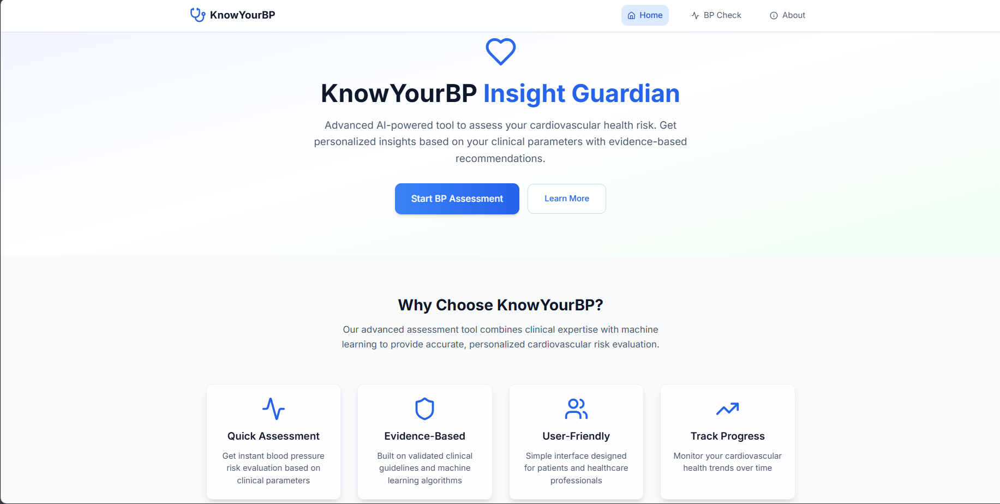
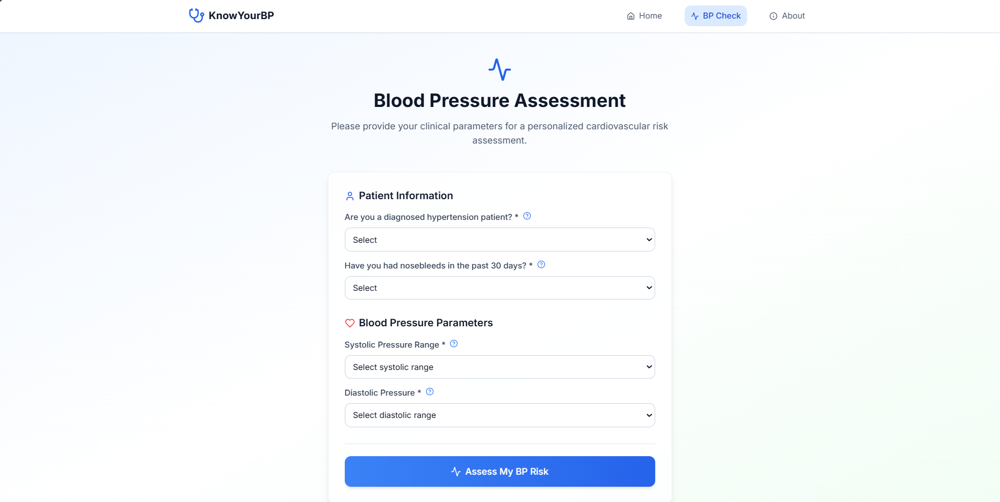
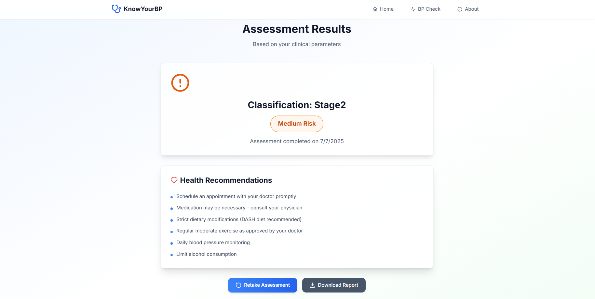

# Blood Pressure Prediction Project

## Project Info

This is a web application for blood pressure risk assessment using machine learning.

---

## Application Screenshots

### Home Page


### Assessment Page


### Prediction/Results Page


---

## How to Run This Application Locally

Follow these steps to set up and run the project on your own machine.

### **1. Prerequisites**

- **Node.js & npm** (for the frontend)
  - [Download Node.js](https://nodejs.org/) (npm comes bundled)
- **Python 3.8+** (for the backend)
  - [Download Python](https://www.python.org/downloads/)
- **Git** (to clone the repository)
  - [Download Git](https://git-scm.com/downloads)

---

### **2. Clone the Repository**

```sh
git clone <YOUR_GIT_URL>
cd <YOUR_PROJECT_NAME>
```

---

### **3. Set Up the Backend**

1. Open a terminal and navigate to the `backend` directory:
    ```sh
    cd backend
    ```

2. (Recommended) Create and activate a Python virtual environment:
    ```sh
    python -m venv venv
    # On Windows:
    venv\Scripts\activate
    # On Mac/Linux:
    source venv/bin/activate
    ```

3. Install backend dependencies:
    ```sh
    pip install -r requirements.txt
    ```

4. Make sure your trained model file (e.g., `model_rf.pkl`) is present in the `backend/models/` directory.

5. Start the Flask backend server:
    ```sh
    python app.py
    ```
    The backend will run on [http://localhost:5000](http://localhost:5000) by default.

---

### **4. Set Up the Frontend**

1. Open a new terminal window/tab and navigate to the `frontend` directory:
    ```sh
    cd frontend
    ```

2. Install frontend dependencies:
    ```sh
    npm install
    ```

3. Start the frontend development server:
    ```sh
    npm run dev
    ```
    The frontend will run on [http://localhost:5173](http://localhost:5173) by default (or another port if 5173 is in use).

---

### **5. Access the Application**

- Open your browser and go to [http://localhost:5173](http://localhost:5173)
- Fill out the form and submit to get your blood pressure risk assessment.

---

## **Troubleshooting**

- **CORS errors:** Make sure the backend is running before the frontend, and that Flask-CORS is installed and enabled.
- **Port conflicts:** If ports 5000 (backend) or 5173 (frontend) are in use, stop the other services or change the port in your configuration.
- **Model file missing:** Ensure `model_rf.pkl` is present in the correct directory (`backend/models/`).

---

## **Project Structure**

```
PULSE-PREDICTION/
│
├── backend/
│   ├── app.py
│   ├── requirements.txt
│   └── models/
│       └── model_rf.pkl
│
├── frontend/
│   ├── src/
│   ├── package.json
│   └── ...
│
└── README.md
```

---

## **Technologies Used**

- **Frontend:** React, TypeScript, Vite, Tailwind CSS, shadcn-ui
- **Backend:** Flask, Flask-CORS, scikit-learn, pandas, numpy

---

